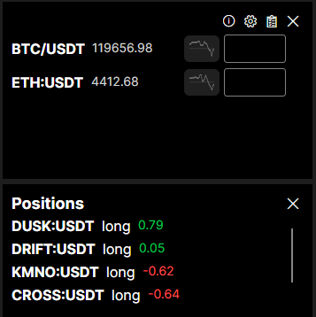

# CryptoWidget

[English](README.md) | [繁體中文](Readme/README.zh_TW.md) | [简体中文](Readme/README.zh_CN.md)

A lightweight cryptocurrency price monitoring widget built with the Avalonia UI framework as a cross-platform desktop application.

## 📱 Screenshot

## 🌟 Features

### 📊 Real-time Price Monitoring
- **Multiple Exchange Support**: Based on ccxt supported types

### 🎨 User Interface
- **Transparent Window**: Adjustable transparency with 10%-100% transparency settings
- **Always on Top**: Option to keep window on top of other applications
- **Borderless Design**: Modern borderless window design
- **System Tray Support**: Minimize to system tray, double-click icon to restore

### ⚙️ Settings
- **Custom Cryptocurrencies**: Freely add/remove cryptocurrencies to monitor
- **Exchange Selection**: Choose different exchanges as price sources
- **Close Behavior**: Configure whether clicking close button hides or completely closes the application

### 🔧 Technical Features
- **Cross-platform**: Based on Avalonia UI framework, supports Windows, macOS, Linux (untested on non-Windows systems, may have multiple issues)
- **MVVM Architecture**: Adopts MVVM design pattern with clear code structure

## 📋 System Requirements

- **Operating System**: Windows 10/11, macOS 10.15+, Linux (Ubuntu 18.04+)
- **.NET Runtime**: .NET 8.0 or newer

## 🚀 Getting Started

### Download Pre-compiled Version
1. Go to the [Releases](https://github.com/hawiliu/CryptoWidget/releases) page
2. Download the latest version executable
3. Extract and run `CryptoWidget.exe`

**Note: Non-Windows operating systems are untested and may have multiple issues**

## 📖 User Guide

### Basic Operations
1. **Launch Application**: After execution, the main window will display, default monitoring BTC/USDT
2. **View Prices**: Prices automatically update every 5 seconds
3. **Open Settings**: Click the gear icon in the top-right corner to open settings window
4. **Minimize**: Click the X button in the top-right corner to hide to system tray
5. **System Tray Operations**: Right-click system tray icon to open menu, double-click to restore window

### Settings Guide
- **Window Transparency**: Adjust window transparency, range 10%-100%
- **Keep on Top**: Check to keep window on top of other applications
- **Close Behavior**: Choose whether clicking close button hides or completely closes
- **Exchange Selection**: Select price source exchange from dropdown menu
- **Add Cryptocurrency**: Enter cryptocurrency code in input field (e.g., BTC or BTC/USDT), click ➕ button to add
- **Remove Cryptocurrency**: Click ✖ button next to cryptocurrency to remove

### Supported Cryptocurrency Formats
- **Short Format**: BTC, ETH, ADA (automatically adds /USDT)
- **Full Format**: BTC/USDT, ETH/USDT, ADA/USDT
- **Contract Format**: BTC:USDT, ETH:USDT (supported by some exchanges)

## 🔧 Technical Architecture

### Frontend Framework
- **Avalonia UI**: Cross-platform UI framework
- **MVVM Pattern**: Model-View-ViewModel architecture
- **CommunityToolkit.Mvvm**: MVVM toolkit

### Backend Services
- **Microsoft.Extensions.Hosting**: Dependency injection container
- **AutoMapper**: Object mapping tool
- **ccxt**: Cryptocurrency exchange API library

## 🔧 Development Environment Setup
1. Install .NET 8.0 SDK
2. Install Visual Studio 2022 or VS Code
3. Clone the project and open the solution
4. Restore NuGet packages
5. Build and run the project
6. (Optional) Run publish.bat to build executables for various platforms

## 📄 License

This project is licensed under the MIT License

## 🙏 Acknowledgments

- [Avalonia UI](https://avaloniaui.net/) - Cross-platform UI framework
- [ccxt](https://github.com/ccxt/ccxt) - Cryptocurrency exchange API library
- [CommunityToolkit.Mvvm](https://github.com/CommunityToolkit/dotnet) - MVVM toolkit

## 🖼️ Icon License

Application icon sourced from [icon-icons.com](https://icon-icons.com/icon/usd-crypto-cryptocurrency-cryptocurrencies-cash-money-bank-payment/95103)

**App icon © Christopher Downer** — sourced from icon-icons.com

---

⭐ If this project helps you, please give me a star! 