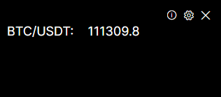

# CryptoWidget

[English](../README.md) | [繁體中文](README.zh_TW.md) | [简体中文](README.zh_CN.md)

一个轻量级的加密货币价格监控小工具，使用 Avalonia UI 框架开发的跨平台桌面应用程序。

## 📱 截图

## 🌟 功能特色

### 📊 实时价格监控
- **多个交易所支持**：依照ccxt支持类型

### 🎨 用户界面
- **透明窗口**：可调整透明度，支持 10%-100% 透明度设置
- **置顶显示**：可设置窗口保持最上层
- **无边框设计**：现代化的无边框窗口设计
- **系统托盘支持**：支持最小化到系统托盘，双击图标可重新显示

### ⚙️ 设置功能
- **自定义币种**：可自由添加/移除监控的加密货币
- **交易所选择**：可选择不同的交易所作为价格来源
- **关闭行为**：可设置点击关闭按钮时隐藏或完全关闭应用程序

### 🔧 技术特色
- **跨平台**：基于 Avalonia UI 框架，支持 Windows、macOS、Linux（Windows以外的操作系统未测试，可能存在多个异常）
- **MVVM 架构**：采用 MVVM 设计模式，代码结构清晰

## 📋 系统需求

- **操作系统**：Windows 10/11、macOS 10.15+、Linux (Ubuntu 18.04+)
- **.NET Runtime**：.NET 8.0 或更新版本

## 🚀 执行

### 下载预编译版本
1. 前往 [Releases](https://github.com/hawiliu/CryptoWidget/releases) 页面
2. 下载最新版本的执行文件
3. 解压缩并执行 `CryptoWidget.exe`

**注. Windows以外的操作系统未测试，可能存在多个异常**

## 📖 使用说明

### 基本操作
1. **启动应用程序**：执行后会显示主窗口，默认监控 BTC/USDT
2. **查看价格**：价格会每 5 秒自动更新一次
3. **打开设置**：点击右上角齿轮图标打开设置窗口
4. **最小化**：点击右上角 X 按钮会隐藏到系统托盘
5. **系统托盘操作**：右键点击系统托盘图标可打开菜单，双击可重新显示窗口

### 设置说明
- **窗口透明度**：调整窗口透明度，范围 10%-100%
- **保持最上层**：勾选后窗口会保持在最上层
- **关闭行为**：选择点击关闭按钮时隐藏或完全关闭
- **交易所选择**：从下拉菜单选择价格来源交易所
- **新增币种**：在输入框中输入币种代码（如 BTC 或 BTC/USDT），点击 ➕ 按钮新增
- **移除币种**：点击币种旁的 ✖ 按钮移除

### 支持的币种格式
- **简短格式**：BTC、ETH、ADA（会自动补上 /USDT）
- **完整格式**：BTC/USDT、ETH/USDT、ADA/USDT
- **合约格式**：BTC:USDT、ETH:USDT（部分交易所支持）

## 🔧 技术架构

### 前端框架
- **Avalonia UI**：跨平台 UI 框架
- **MVVM 模式**：Model-View-ViewModel 架构
- **CommunityToolkit.Mvvm**：MVVM 工具库

### 后端服务
- **Microsoft.Extensions.Hosting**：依赖注入容器
- **AutoMapper**：对象映射工具
- **ccxt**：加密货币交易所 API 库

## 🔧 开发环境设置
1. 安装 .NET 8.0 SDK
2. 安装 Visual Studio 2022 或 VS Code
3. 复制项目并打开解决方案
4. 还原 NuGet 包
5. 构建并执行项目
6. (可选)执行publish.bat构建各平台执行文件

## 📄 授权条款

本项目采用 MIT 授权条款

## 🙏 致谢

- [Avalonia UI](https://avaloniaui.net/) - 跨平台 UI 框架
- [ccxt](https://github.com/ccxt/ccxt) - 加密货币交易所 API 库
- [CommunityToolkit.Mvvm](https://github.com/CommunityToolkit/dotnet) - MVVM 工具库

## 🖼️ 图标授权

应用程序图标来源于 [icon-icons.com](https://icon-icons.com/icon/usd-crypto-cryptocurrency-cryptocurrencies-cash-money-bank-payment/95103)

**App icon © Christopher Downer** — sourced from icon-icons.com

---

⭐ 如果这个项目对您有帮助，请给我一个星标！
